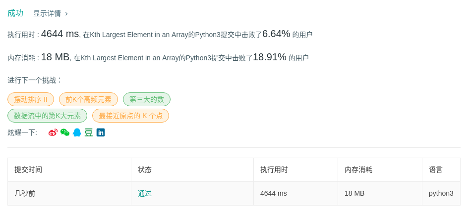
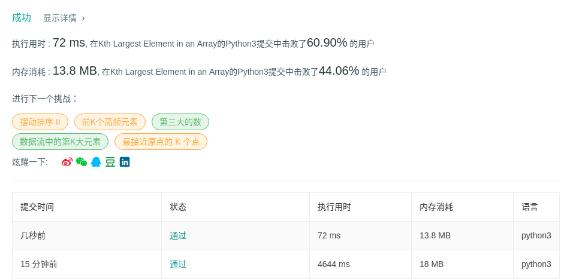

# 215 数组中的第k个最大元素

## 题目描述

在未排序的数组中找到第k个最大的元素。请注意，你需要找的是数组排序后的第k个最大的元素，而不是第k个不同的元素。

**示例1**

- 输入：`[3,2,1,5,6,4]`和`k=2`
- 输出：5

**示例2**：

- 输入：`[3,2,3,1,2,4,5,5,6]`和`k=4`
- 输出：4

## 代码1（快排）

```python
class Solution:
    def findKthLargest(self, nums: List[int], k: int) -> int:
        self.quick(nums, 0, len(nums) - 1)
        return nums[k - 1]

    def quick(self, nums, low, high):
        if low < high:
            pivot_pos = self.partition(nums, low, high)
            self.quick(nums, low, pivot_pos - 1)
            self.quick(nums, pivot_pos + 1, high)

    def partition(self, nums, low, high):
        pivot = nums[low]
        while low < high:
            while low < high and nums[high] <= pivot:
                high -= 1
            nums[low] = nums[high]
            while low < high and nums[low] >= pivot:
                low += 1
            nums[high] = nums[low]
        nums[low] = pivot
        return low
```



## 代码2（快选）

```python
class Solution:
    def findKthLargest(self, nums: List[int], k: int) -> int:
        k = len(nums) - k
        left, right = 0, len(nums) - 1
        while True:
            index = self.partition(nums, left, right)
            if index == k:
                return nums[index]
            if index > k:
                right = index - 1
            else:
                left = index + 1
                
    def partition(self, nums, left, right):
        rand_index = random.randint(left, right)
        rand_entry = nums[rand_index]
        nums[rand_index], nums[right] = nums[right], nums[rand_index]
        next_lower = left
        for i in range(left, right):
            if nums[i] <= rand_entry:
                nums[next_lower], nums[i] = nums[i], nums[next_lower]
                next_lower += 1
        nums[next_lower], nums[right] = nums[right], nums[next_lower]
        return next_lower
```



