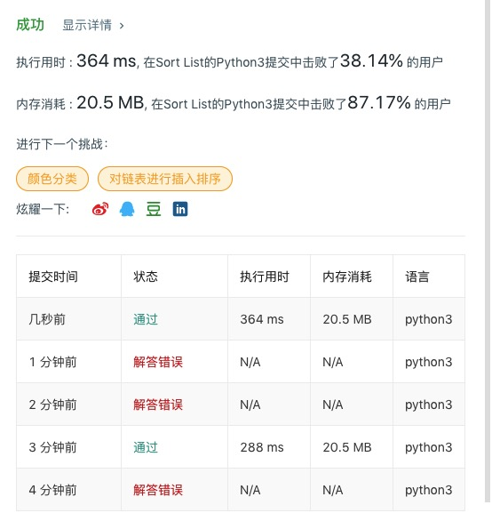

# 148 排序链表

## 题目描述

在 *O*(*n* log *n*) 时间复杂度和常数级空间复杂度下，对链表进行排序。

**示例 1:**

```
输入: 4->2->1->3
输出: 1->2->3->4
```

**示例 2:**

```
输入: -1->5->3->4->0
输出: -1->0->3->4->5
```

## 代码

**归并排序，时间复杂度O(nlogn)，但是空间复杂度是O(n)**

```python
# Definition for singly-linked list.
# class ListNode:
#     def __init__(self, x):
#         self.val = x
#         self.next = None

class Solution:
    def sortList(self, head: ListNode) -> ListNode:
        if not head or not head.next:
            return head
        
        slow, fast, prev = head, head, None
        while fast and fast.next:
            prev, fast, slow = slow, fast.next.next, slow.next
        
        prev.next = None
        one = self.sortList(head)
        two = self.sortList(slow)
        
        return self.merge(one, two)
        
    def merge(self, one, two):
        dummy = merged = ListNode(None)
        while one and two:
            if one.val <= two.val:
                merged.next = one
                one = one.next
            else:
                merged.next = two
                two = two.next
            merged = merged.next
            
        
        while one:
            merged.next = one
            one = one.next
            merged = merged.next
        while two:
            merged.next = two
            two = two.next
            merged = merged.next
        
        #merged.next = one or two
        
        return dummy.next
        
```

