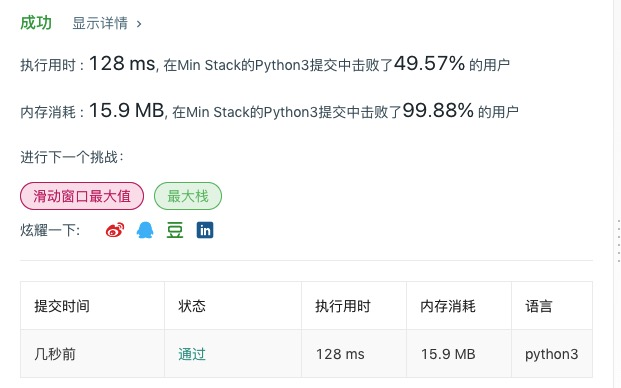

# 155 最小栈

## 题目描述

设计一个支持 push，pop，top 操作，并能在常数时间内检索到最小元素的栈。

- push(x) -- 将元素 x 推入栈中。
- pop() -- 删除栈顶的元素。
- top() -- 获取栈顶元素。
- getMin() -- 检索栈中的最小元素。

**示例:**

```
MinStack minStack = new MinStack();
minStack.push(-2);
minStack.push(0);
minStack.push(-3);
minStack.getMin();   --> 返回 -3.
minStack.pop();
minStack.top();      --> 返回 0.
minStack.getMin();   --> 返回 -2.
```

## 代码

```python
class MinStack:

    def __init__(self):
        """
        initialize your data structure here.
        """
        self.stack = []
        self.top_pointer = -1
        self.min = float('inf')

    def push(self, x: int) -> None:
        self.stack.append(x)
        self.top_pointer += 1
        if x < self.min:
            self.min = x

    def pop(self) -> None:
        self.stack.pop()
        self.top_pointer -= 1
        self.min = float('inf')
        for i in self.stack:
            if i < self.min:
                self.min = i

    def top(self) -> int:
        return self.stack[self.top_pointer]
        
    def getMin(self) -> int:
        return self.min


# Your MinStack object will be instantiated and called as such:
# obj = MinStack()
# obj.push(x)
# obj.pop()
# param_3 = obj.top()
# param_4 = obj.getMin()
```

