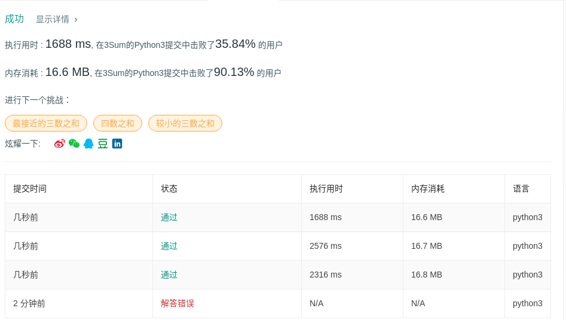

# 15 三数之和

## 题目描述

给定一个包含 *n* 个整数的数组 `nums`，判断 `nums` 中是否存在三个元素 *a，b，c ，*使得 *a + b + c =* 0 ？找出所有满足条件且不重复的三元组。

**注意：**答案中不可以包含重复的三元组。

```
例如, 给定数组 nums = [-1, 0, 1, 2, -1, -4]，

满足要求的三元组集合为：
[
  [-1, 0, 1],
  [-1, -1, 2]
]
```

## 代码

```python
class Solution:
    def threeSum(self, nums: List[int]) -> List[List[int]]:
        results = []
        nums.sort()
        
        i = 0
        while i < len(nums):
            j = i + 1
            k = len(nums) - 1
            
            while j < k:
                triple_sum = nums[i] + nums[j] + nums[k]
                
                if triple_sum == 0:
                    results.append([nums[i], nums[j], nums[k]])
                    k -= 1
                    while k > j and nums[k] == nums[k + 1]:
                        k -= 1
                    j += 1
                    while j < k and nums[j] == nums[j - 1]:
                        j += 1
                
                elif triple_sum > 0:
                    k -= 1
                    while k > j and nums[k] == nums[k + 1]:
                        k -= 1
                else:
                    j += 1
                    while j < k and nums[j] == nums[j - 1]:
                        j += 1
            i += 1
            while i < len(nums) - 2 and nums[i] == nums[i - 1]:
                i += 1
                
        return results
```

