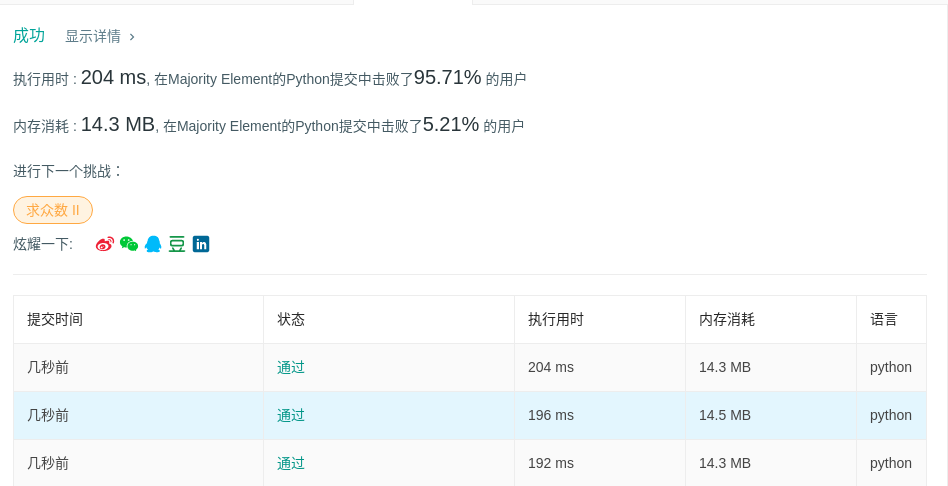

# 169 求众数

## 题目描述

给定一个大小为 *n* 的数组，找到其中的众数。众数是指在数组中出现次数**大于** `⌊ n/2 ⌋` 的元素。

你可以假设数组是非空的，并且给定的数组总是存在众数。

**示例 1:**

```
输入: [3,2,3]
输出: 3
```

**示例 2:**

```
输入: [2,2,1,1,1,2,2]
输出: 2
```

## 代码

```python
class Solution(object):
    def majorityElement(self, nums):
        """
        :type nums: List[int]
        :rtype: int
        """
        current = nums[0]
        count = 1
        for i in range(1, len(nums)):
            if count == 0:
                current = nums[i]
            if nums[i] == current:
                count += 1
            else:
                count -= 1
        return current
```

