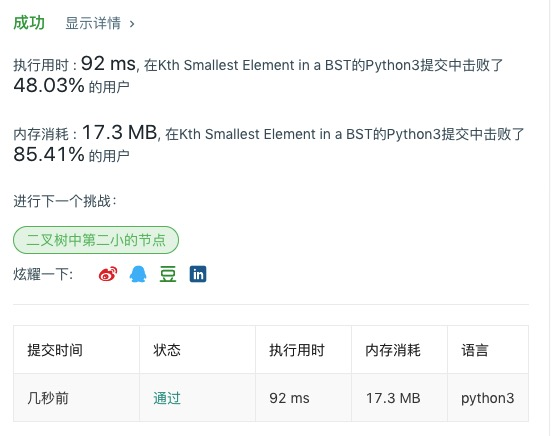

# 230 二叉搜索树中第k小的元素

## 题目描述

给定一个二叉搜索树，编写一个函数 `kthSmallest` 来查找其中第 **k** 个最小的元素。

**说明：**
你可以假设 k 总是有效的，1 ≤ k ≤ 二叉搜索树元素个数。

**示例 1:**

```
输入: root = [3,1,4,null,2], k = 1
   3
  / \
 1   4
  \
   2
输出: 1
```

**示例 2:**

```
输入: root = [5,3,6,2,4,null,null,1], k = 3
       5
      / \
     3   6
    / \
   2   4
  /
 1
输出: 3
```

**进阶：**
如果二叉搜索树经常被修改（插入/删除操作）并且你需要频繁地查找第 k 小的值，你将如何优化 `kthSmallest` 函数？

## 代码

```python
# Definition for a binary tree node.
# class TreeNode:
#     def __init__(self, x):
#         self.val = x
#         self.left = None
#         self.right = None

class Solution:
    def kthSmallest(self, root: TreeNode, k: int) -> int:
        results = []
        self.inorderTraverse(root, results, k)
        return results[k - 1]
    
    def inorderTraverse(self, root, results, k):
        if not root.left is None:
            self.inorderTraverse(root.left, results, k)
        results.append(root.val)
        if not root.right is None:
            self.inorderTraverse(root.right, results, k)
        if len(results) == k:
            return results
```

