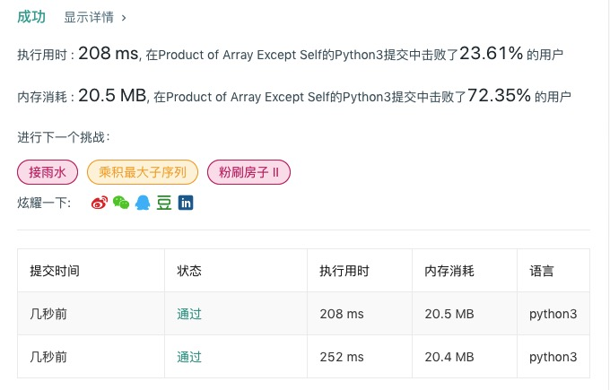

# 238 除自身以外数组的乘积

## 题目描述

给定长度为 *n* 的整数数组 `nums`，其中 *n* > 1，返回输出数组 `output` ，其中 `output[i]` 等于 `nums` 中除 `nums[i]` 之外其余各元素的乘积。

**示例:**

```
输入: [1,2,3,4]
输出: [24,12,8,6]
```

**说明:** 请**不要使用除法，**且在 O(*n*) 时间复杂度内完成此题。

**进阶：**
你可以在常数空间复杂度内完成这个题目吗？（ 出于对空间复杂度分析的目的，输出数组**不被视为**额外空间。）

## 代码

```python 
class Solution:
    def productExceptSelf(self, nums: List[int]) -> List[int]:
        products = [1]
        for i in range(1, len(nums)):
            products.append(products[-1] * nums[i-1])
            
        right_product = 1
        for i in range(len(nums) - 1, -1, -1):
            products[i] *= right_product
            right_product *= nums[i]
        return products
```

