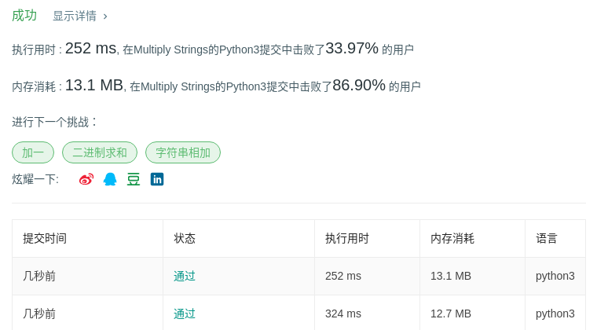

# 43 字符串相乘

## 题目描述

给定两个以字符串形式表示的非负整数 `num1` 和 `num2`，返回 `num1` 和 `num2` 的乘积，它们的乘积也表示为字符串形式。

**示例 1:**

```
输入: num1 = "2", num2 = "3"
输出: "6"
```

**示例 2:**

```
输入: num1 = "123", num2 = "456"
输出: "56088"
```

**说明：**

1. `num1` 和 `num2` 的长度小于110。
2. `num1` 和 `num2` 只包含数字 `0-9`。
3. `num1` 和 `num2` 均不以零开头，除非是数字 0 本身。
4. **不能使用任何标准库的大数类型（比如 BigInteger）**或**直接将输入转换为整数来处理**。

## 代码

```python
class Solution:
    def multiply(self, num1: str, num2: str) -> str:
        num1, num2 = num1[::-1], num2[::-1]
        result = [0] * (len(num1) + len(num2))
        
        for i in range(len(num1)):
            int1 = ord(num1[i]) - ord('0')
            for j in range(len(num2)):
                int2 = ord(num2[j]) - ord('0')
                tens, units = divmod(int1 * int2, 10)
                result[i + j] += units
                if result[i + j] > 9:
                    result[i + j + 1] += result[i + j] // 10
                    result[i + j] %= 10
                    
                result[i + j + 1] += tens
                if result[i + j + 1] > 9:
                    result[i + j + 2] += result[i + j + 1] // 10
                    result[i + j + 1] %= 10
                    
        while len(result) > 1 and result[-1] == 0:
            result.pop()
        return "".join(map(str, result[::-1]))
```

