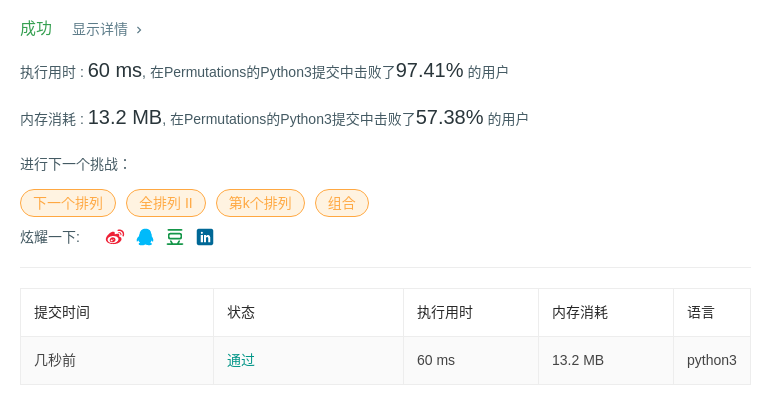

# 46 全排列

## 题目描述

给定一个**没有重复**数字的序列，返回其所有可能的全排列。

**示例:**

```
输入: [1,2,3]
输出:
[
  [1,2,3],
  [1,3,2],
  [2,1,3],
  [2,3,1],
  [3,1,2],
  [3,2,1]
]
```

## 代码

```python
class Solution:
    def permute(self, nums: List[int]) -> List[List[int]]:
        permutations = [[]]
        
        for num in nums:
            new_permutations = []
            for perm in permutations:
                for i in range(0, len(perm) + 1):
                    new_permutations.append(perm[:i] + [num] + perm[i:])
            permutations = new_permutations
        return permutations
```

