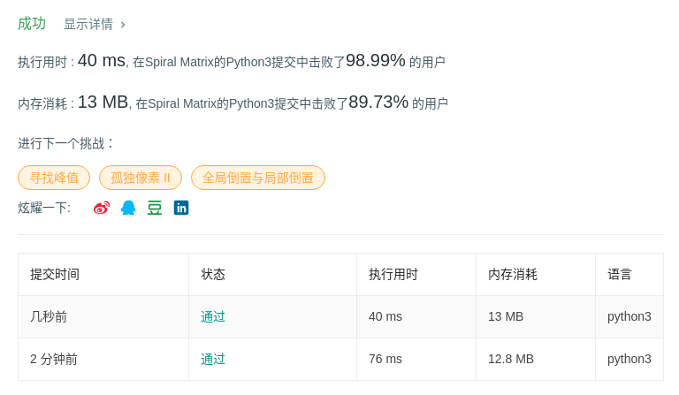

# 54 螺旋矩阵I

## 题目描述

给定一个包含 *m* x *n* 个元素的矩阵（*m* 行, *n* 列），请按照顺时针螺旋顺序，返回矩阵中的所有元素。

**示例 1:**

```
输入:
[
 [ 1, 2, 3 ],
 [ 4, 5, 6 ],
 [ 7, 8, 9 ]
]
输出: [1,2,3,6,9,8,7,4,5]
```

**示例 2:**

```
输入:
[
  [1, 2, 3, 4],
  [5, 6, 7, 8],
  [9,10,11,12]
]
输出: [1,2,3,4,8,12,11,10,9,5,6,7]
```

## 代码

```python
class Solution:
    def spiralOrder(self, matrix: List[List[int]]) -> List[int]:
        if not matrix or not matrix[0]:
            return []
        
        spiral = []
        row, col = 0, -1
        d_row, d_col = 0, 1
        row_leg, col_leg = len(matrix[0]), len(matrix) - 1
        leg_count = 0
        
        for _ in range(len(matrix[0]) * len(matrix)):
            row += d_row
            col += d_col
            spiral.append(matrix[row][col])
            leg_count += 1
            
            if (d_col != 0 and leg_count == row_leg) or (d_row != 0 and leg_count == col_leg):
                if d_col != 0:
                    row_leg -= 1
                else:
                    col_leg -= 1
                d_row, d_col = d_col, -d_row
                leg_count = 0
                
        return spiral
```

