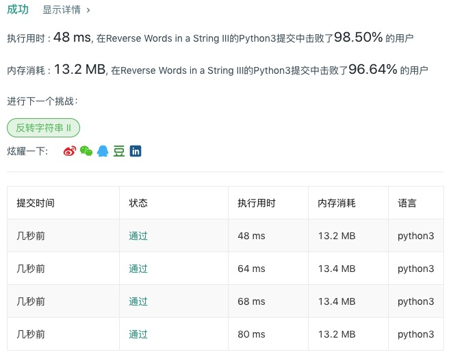

# 557 反转字符串中的单词III

## 题目描述

给定一个字符串，你需要反转字符串中每个单词的字符顺序，同时仍保留空格和单词的初始顺序。

**示例 1:**

```
输入: "Let's take LeetCode contest"
输出: "s'teL ekat edoCteeL tsetnoc" 
```

**注意：**在字符串中，每个单词由单个空格分隔，并且字符串中不会有任何额外的空格。

## 代码

```python
class Solution:
    def reverseWords(self, s: str) -> str:
        a = s.split(' ')
        b = [self.reverseWord(i) for i in a]
        result = ''.join(b)
        return result.rstrip()
    
    def reverseWord(self, string):
        return string[::-1]+' '
```

