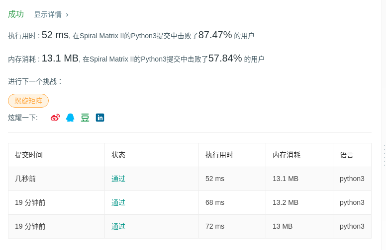

# 59 螺旋矩阵 II

## 题目描述

给定一个正整数 *n*，生成一个包含 1 到 *n*2 所有元素，且元素按顺时针顺序螺旋排列的正方形矩阵。

**示例:**

```
输入: 3
输出:
[
 [ 1, 2, 3 ],
 [ 8, 9, 4 ],
 [ 7, 6, 5 ]
]
```

## 代码

```python
class Solution:
    def generateMatrix(self, n: int) -> List[List[int]]:
        spiral = [[0 for _ in range(n)] for _ in range(n)]
        row, col = 0, 0
        d_r, d_c = 0, 1
        count = 1
        while count <= n * n:
            spiral[row][col] = count
            count += 1
            if row + d_r < 0 or row + d_r >= n or col + d_c < 0 or col + d_c >= n or spiral[row+d_r][col+d_c] != 0:
                d_r, d_c = d_c, -d_r
            row += d_r
            col += d_c
            
        return spiral
```



