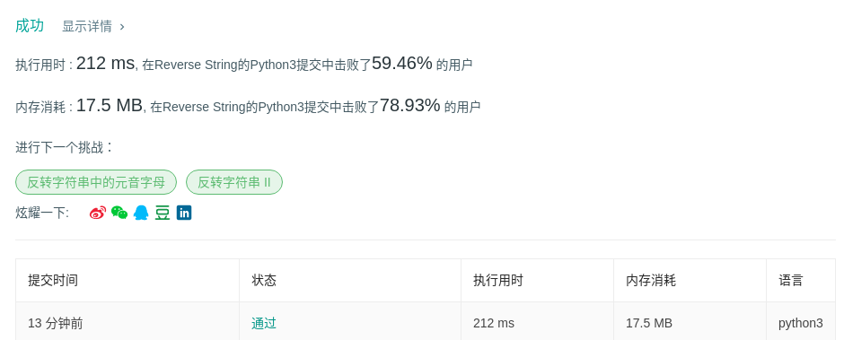

# 344 反转字符串

## 题目描述

编写一个函数，其作用是将输入的字符串反过来。输入字符串以字符串数组`char[]`的形式给出。

不要给另外的数组分配额外的空间，你必须**原地修改输入数组**，使用`O(1)`的额外空间解决这个问题。

你可以假设数组中的所有字符都是`ASCII`码表中的可打印字符。

**示例1**

- 输入：`["h","e","l","l","o"]`
- 输出：`["o","e","l","l","h"]`

**示例2**

- 输入：`["H","a","n","n","a","h"]`
- 输出：`["h","a","n","n","a","H"]`

## 代码

```python
class Solution:
    def reverseString(self, s: List[str]) -> None:
        """
        Do not return anything, modify s in-place instead.
        """
        final = len(s) - 1
        for i in range(len(s)// 2):
            temp = s[i]
            s[i] = s[final]
            s[final] = temp
            final -= 1
```




